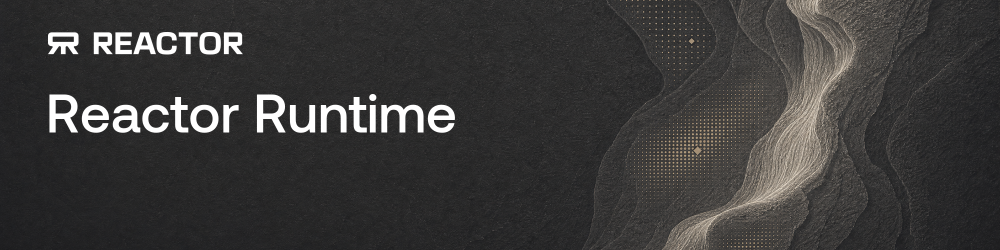

<div align="center">



**Build real-time AI models in Python.**

[📖 Documentation](https://deploy-docs.reactor.inc) · [🚀 Quickstart](https://deploy-docs.reactor.inc/development/quickstart) · [🌐 Reactor](https://reactor.inc)

</div>

---

Reactor Runtime turns an inference pipeline into a real-time, interactive media and data stream. You write `load()` and `run()`; the runtime handles the session lifecycle, the WebRTC media transport, and the wire protocol that connects clients to your model. Viewers watch frames as they are generated and change what the model is doing mid-stream, with no restart and no re-queue.

## Highlights

- 📡 **Real-time streaming.** Frames reach clients over WebRTC as your model produces them, not after a whole video is done. `emit()` paces your loop to the rate clients play at, so a model needs no rate limiter of its own.
- 🎮 **Live interaction.** Clients send commands mid-generation: change a prompt, move a camera, adjust a parameter. The next frame reflects it.
- 🔌 **No transport code.** You never import a WebRTC library, manage a WebSocket, or encode video. The runtime ships its own media engine as a wheel, so a plain Python container is all a model needs.
- ✅ **Typed, validated commands.** Declare the commands your model accepts with standard Python types and constraints. The runtime validates every payload before your handler runs and compiles the surface into an OpenAPI schema that drives typed client SDKs.
- 📦 **One container, anywhere.** The `reactor` CLI scaffolds a workspace, builds a small image, and runs it locally. The same image deploys to [Reactor](https://reactor.inc)'s GPU cloud unchanged.
- 🧩 **More than one GPU, without giving up the server.** A model that needs several devices keeps its single event loop, session, and output stream: subclass `DistributedWorker` for the per-GPU half and hold a `WorkerGroup` in the model. The framework spawns the ranks, gives them a process group, and then stays out of it — how you shard is yours.

## How it works

A model is a `ReactorModel` subclass in `model.py`. Declare the media it sends, load your weights once, and write the loop that receives or produces frames, data, and more:

```python
from pathlib import Path

from reactor_runtime import InputField, Output, ReactorModel, Video, event


class MyOutput(Output):
    main_video: Video


class MyModel(ReactorModel):
    fps = 24

    def load(self, config_path: Path | None) -> None:
        self.pipe = load_my_pipeline()
        self.prompt = "a sunny meadow"

    @event(name="set_prompt", description="Scene the model renders")
    async def set_prompt(self, prompt: str = InputField(default="a sunny meadow")) -> None:
        self.prompt = prompt

    async def run(self) -> None:
        while True:
            await self.connected.wait()
            while self.connected.is_set():
                frame = self.pipe.forward(prompt=self.prompt)
                await self.emit(MyOutput(main_video=frame))
```

That is a complete model. `run()` produces frames for as long as someone is watching, and any client can send `set_prompt` at any time to change what the next frame renders.

Scaffold, build, and run it with the CLI:

```sh
reactor init my-model
cd my-model
reactor run
```

`reactor run` builds a container with the runtime inside and serves WebRTC signaling on port 8080. Point a browser at it with the [JS SDK](https://docs.reactor.inc), or connect from the [Reactor Sandbox](https://reactor-sandbox.vercel.app/) and watch frames stream immediately.

A model too large for one GPU keeps that shape. Instead of running several copies of the server — which would contend for one port and race each other to the client — the process splits in two: the model above stays exactly as it is and touches no CUDA, while a `WorkerGroup` it builds in `load()` spawns one worker process per device, each an instance of your `DistributedWorker` subclass with its rank, device, and process group already set up. `workers.generate(...)` runs one chunk in lockstep on every rank and hands back the frames to `emit`, so `run()` reads the same as before. The framework issues no collectives of its own, which is what leaves you free to shard however your model wants — tensor-, sequence-, or context-parallel — including by carving sub-groups inside `setup()`.

## Install

Everything runs through the [`reactor` CLI](https://deploy-docs.reactor.inc/platform/installation). There is nothing to install on your host but the CLI and Docker; the runtime ships inside the image the CLI builds for your workspace.

```sh
brew install reactor-team/tools/reactor-cli
```

Not on macOS, or pinning a release in CI? See [Install the CLI](https://deploy-docs.reactor.inc/platform/installation).

## Learn more

- [Quickstart](https://deploy-docs.reactor.inc/development/quickstart): from zero to a streaming model in 2 minutes
- [Model anatomy](https://deploy-docs.reactor.inc/development/reactor-model/model-anatomy): every piece of a Reactor model, line by line
- [The run loop](https://deploy-docs.reactor.inc/development/reactor-model/run-loop): emitting frames, batches, and frame rates

## Development

This repository holds the runtime package itself: the authoring interface, the session runner, the media transport, and the wire protocol. To work on it, use [mise](https://mise.jdx.dev/), which pins the toolchain and forwards every task through a thin `make` shim:

```sh
mise run install      # install deps, generate wire bindings, and git hooks
mise run lint         # ruff check, ruff format --check, and mise.lock drift
mise run format       # apply ruff formatting
mise run typecheck    # ty (strict)
mise run test         # unit tests on the floor Python
mise run test-matrix  # unit tests on every supported Python
```

## License

Licensed under the [Apache License, Version 2.0](./LICENSE).
